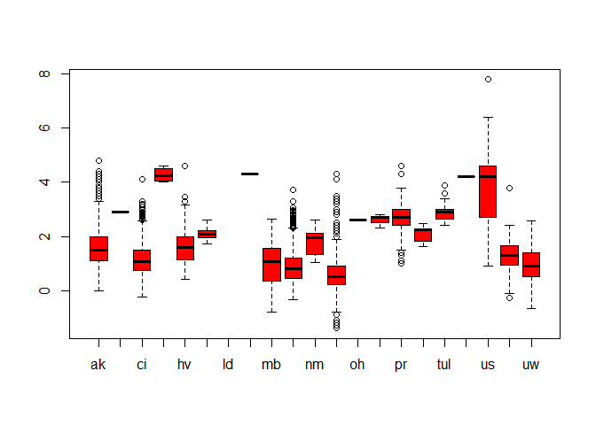
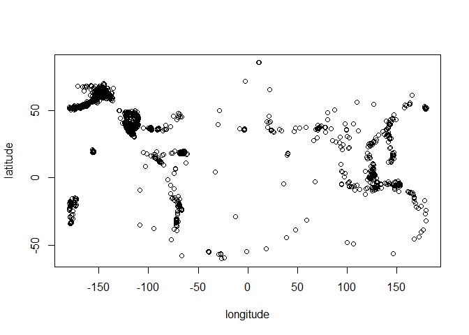
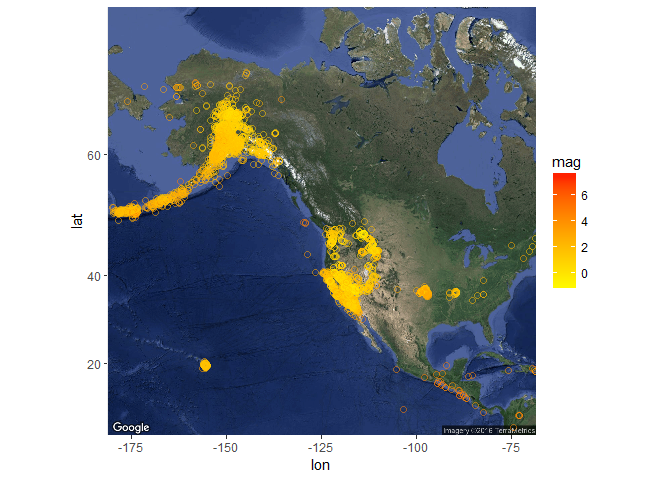
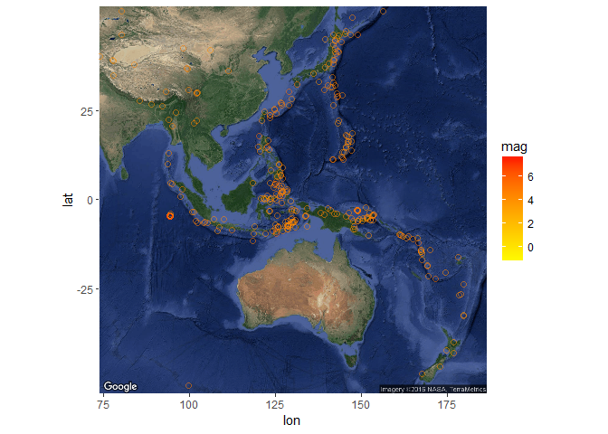
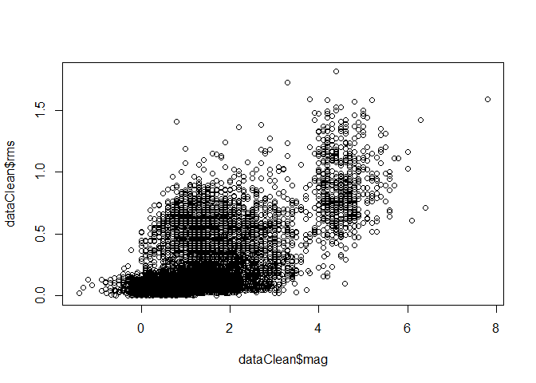
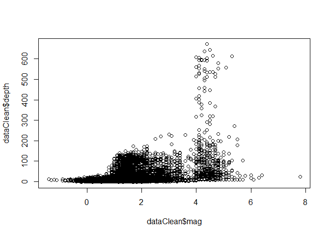
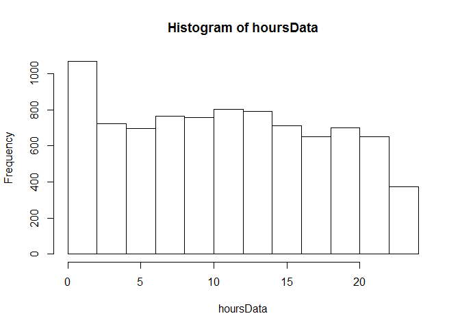

Earthquakes data exploration
================

Data Exploration:
-----------------

### lets check the head of the dataset

    ##                       time latitude longitude  depth  mag magType nst
    ## 1 2016-03-29T08:30:59.000Z 60.26910 -141.7849  14.60 2.40      ml  NA
    ## 2 2016-03-29T08:27:09.620Z 33.87683 -116.7792  -0.17 1.12      ml  14
    ## 3 2016-03-29T08:18:34.090Z  5.49940  124.0900 526.87 4.80      mb  NA
    ## 4 2016-03-29T08:12:55.850Z 38.83467 -122.8643   0.88 0.86      md   9
    ## 5 2016-03-29T08:00:39.720Z 38.82200 -122.8450   1.79 1.03      md  18
    ## 6 2016-03-29T07:54:10.474Z 38.47790 -118.3589   0.00 1.60      ml  10
    ##      gap     dmin  rms net         id                  updated
    ## 1     NA       NA 0.55  ak ak13135976 2016-03-29T08:46:50.587Z
    ## 2 161.00 0.159700 0.31  ci ci37324047 2016-03-29T08:32:11.715Z
    ## 3  76.00 5.468000 0.91  us us20005d4d 2016-03-29T08:36:45.323Z
    ## 4 142.00 0.006287 0.01  nc nc72614210 2016-03-29T08:44:05.087Z
    ## 5  76.00 0.007868 0.02  nc nc72614200 2016-03-29T08:21:06.032Z
    ## 6  95.84 0.046000   NA  nn nn00538095 2016-03-29T07:56:18.452Z
    ##                                place       type horizontalError depthError
    ## 1  42km ENE of Cape Yakataga, Alaska earthquake            0.30       0.10
    ## 2               5km S of Cabazon, CA earthquake            1.12      31.61
    ## 3      74km SW of Mabay, Philippines earthquake            8.00       8.60
    ## 4 11km NW of The Geysers, California earthquake            0.54       0.83
    ## 5 9km WNW of The Geysers, California earthquake            0.25       0.43
    ## 6      23km ESE of Hawthorne, Nevada earthquake              NA         NA
    ##   magError magNst    status locationSource magSource
    ## 1       NA     NA automatic             ak        ak
    ## 2    0.400     23 automatic             ci        ci
    ## 3    0.064     76  reviewed             us        us
    ## 4    0.060      2 automatic             nc        nc
    ## 5    0.010      6 automatic             nc        nc
    ## 6    0.320      6 automatic             nn        nn

as we can see we have 2 datetime columns 12 numeric columns and 8 textual columns
one of the important things we can see is that we have missing values

### lets explore some data statistics

    ## Earthquake_30Days 
    ## 
    ##  22  Variables      9092  Observations
    ## ---------------------------------------------------------------------------
    ## time 
    ##       n missing  unique 
    ##    9092       0    9086 
    ## 
    ## lowest : 2016-02-28T08:55:23.900Z 2016-02-28T08:56:12.570Z 2016-02-28T09:06:25.870Z 2016-02-28T09:09:24.740Z 2016-02-28T09:14:30.500Z
    ## highest: 2016-03-29T08:00:39.720Z 2016-03-29T08:12:55.850Z 2016-03-29T08:18:34.090Z 2016-03-29T08:27:09.620Z 2016-03-29T08:30:59.000Z 
    ## ---------------------------------------------------------------------------
    ## latitude 
    ##       n missing  unique    Info    Mean     .05     .10     .25     .50 
    ##    9092       0    7706       1   41.78   18.33   32.89   36.47   38.81 
    ##     .75     .90     .95 
    ##   54.65   62.83   63.69 
    ## 
    ## lowest : -59.75 -58.88 -57.49 -56.52 -56.47
    ## highest:  69.33  70.12  71.64  85.09  85.11 
    ## ---------------------------------------------------------------------------
    ## longitude 
    ##       n missing  unique    Info    Mean     .05     .10     .25     .50 
    ##    9092       0    7951       1  -118.6 -165.89 -153.29 -149.04 -121.53 
    ##     .75     .90     .95 
    ## -117.30  -98.76  -65.66 
    ## 
    ## lowest : -179.9 -179.9 -179.9 -179.9 -179.8
    ## highest:  179.7  179.7  179.7  179.8  180.0 
    ## ---------------------------------------------------------------------------
    ## depth 
    ##        n  missing   unique     Info     Mean      .05      .10      .25 
    ##     9092        0     2947        1    23.01   0.1322   1.3100   3.0600 
    ##      .50      .75      .90      .95 
    ##   7.0000  16.9000  74.4900 105.6000 
    ## 
    ## lowest :  -3.41  -3.38  -3.35  -2.83  -2.17
    ## highest: 607.29 612.36 615.38 637.27 672.03 
    ## ---------------------------------------------------------------------------
    ## mag 
    ##       n missing  unique    Info    Mean     .05     .10     .25     .50 
    ##    9034      58     382       1    1.43    0.10    0.30    0.67    1.20 
    ##     .75     .90     .95 
    ##    1.87    2.90    4.20 
    ## 
    ## lowest : -1.4 -1.3 -1.2 -1.1 -0.9, highest:  5.8  6.0  6.3  6.4  7.8 
    ## ---------------------------------------------------------------------------
    ## magType 
    ##       n missing  unique 
    ##    9092       0      15 
    ## 
    ##               mb Mb mb_lg   md  Md mh   ml Ml mw mwb mwc mwp mwr mww
    ## Frequency 58 551  2    94 2425 184  2 5740  1  2   4   1   1  17  10
    ## %          1   6  0     1   27   2  0   63  0  0   0   0   0   0   0
    ## ---------------------------------------------------------------------------
    ## nst 
    ##       n missing  unique    Info    Mean     .05     .10     .25     .50 
    ##    5724    3368      93       1    16.4       4       5       7      11 
    ##     .75     .90     .95 
    ##      21      37      45 
    ## 
    ## lowest :   3   4   5   6   7, highest: 112 113 121 127 143 
    ## ---------------------------------------------------------------------------
    ## gap 
    ##       n missing  unique    Info    Mean     .05     .10     .25     .50 
    ##    6623    2469    1747       1   124.9    43.0    53.0    75.0   114.0 
    ##     .75     .90     .95 
    ##   155.0   220.6   257.4 
    ## 
    ## lowest :  14.0  15.0  17.0  18.0  19.0
    ## highest: 338.4 342.0 345.0 345.6 352.8 
    ## ---------------------------------------------------------------------------
    ## dmin 
    ##        n  missing   unique     Info     Mean      .05      .10      .25 
    ##     6354     2738     4195        1   0.3701 0.005424 0.007686 0.020000 
    ##      .50      .75      .90      .95 
    ## 0.049000 0.143875 0.551900 1.830700 
    ## 
    ## lowest : 2.920e-04 3.218e-04 3.902e-04 4.255e-04 5.610e-04
    ## highest: 1.965e+01 2.016e+01 2.026e+01 3.147e+01 3.629e+01 
    ## ---------------------------------------------------------------------------
    ## rms 
    ##       n missing  unique    Info    Mean     .05     .10     .25     .50 
    ##    9085       7    1148       1  0.2773    0.02    0.03    0.07    0.16 
    ##     .75     .90     .95 
    ##    0.44    0.68    0.82 
    ## 
    ## lowest : 0.0000 0.0003 0.0006 0.0011 0.0021
    ## highest: 1.5800 1.5900 1.7200 1.8100 1.8500 
    ## ---------------------------------------------------------------------------
    ## net 
    ##       n missing  unique 
    ##    9092       0      14 
    ## 
    ##             ak   ci  hv ismpkansas ld  mb   nc nm   nn  pr se  us  uu  uw
    ## Frequency 2663 1031 222         13  4 182 2045 20 1471 184  5 933 132 187
    ## %           29   11   2          0  0   2   22  0   16   2  0  10   1   2
    ## ---------------------------------------------------------------------------
    ## id 
    ##       n missing  unique 
    ##    9092       0    9092 
    ## 
    ## lowest : ak12906248 ak12906250 ak12906904 ak12906907 ak12907586
    ## highest: uw61133481 uw61133541 uw61133566 uw61136236 uw61136316 
    ## ---------------------------------------------------------------------------
    ## updated 
    ##       n missing  unique 
    ##    9092       0    9092 
    ## 
    ## lowest : 2016-02-28T09:53:04.589Z 2016-02-28T09:57:11.160Z 2016-02-28T11:39:10.014Z 2016-02-28T12:28:45.897Z 2016-02-28T13:05:53.630Z
    ## highest: 2016-03-29T08:36:45.323Z 2016-03-29T08:41:03.462Z 2016-03-29T08:42:37.609Z 2016-03-29T08:44:05.087Z 2016-03-29T08:46:50.587Z 
    ## ---------------------------------------------------------------------------
    ## place 
    ##       n missing  unique 
    ##    9092       0    5099 
    ## 
    ## lowest : 0km E of San Ramon, California     0km ENE of Carson City, Nevada     0km ENE of Loma Linda, California  0km ENE of Quarry near Salinas, CA 0km ENE of Ridgely, Tennessee     
    ## highest: Southwest of Africa                Southwest of Sumatra, Indonesia    Timor Sea                          West Chile Rise                    West of Macquarie Island           
    ## ---------------------------------------------------------------------------
    ## type 
    ##       n missing  unique 
    ##    9092       0       4 
    ## 
    ## earthquake (8963, 99%), explosion (31, 0%) 
    ## not reported (1, 0%), quarry blast (97, 1%) 
    ## ---------------------------------------------------------------------------
    ## horizontalError 
    ##       n missing  unique    Info    Mean     .05     .10     .25     .50 
    ##    9081      11     804       1   1.906    0.16    0.20    0.30    0.60 
    ##     .75     .90     .95 
    ##    1.87    5.86    8.50 
    ## 
    ## lowest :   0.09   0.10   0.11   0.12   0.13
    ## highest:  43.65  51.70  78.54  88.11 146.11 
    ## ---------------------------------------------------------------------------
    ## depthError 
    ##       n missing  unique    Info    Mean     .05     .10     .25     .50 
    ##    8865     227     613       1   3.426    0.20    0.27    0.43    0.87 
    ##     .75     .90     .95 
    ##    3.52    8.00   12.25 
    ## 
    ## lowest :   0.00   0.09   0.10   0.11   0.12
    ## highest: 106.70 113.50 155.50 289.70 563.70 
    ## ---------------------------------------------------------------------------
    ## magError 
    ##       n missing  unique    Info    Mean     .05     .10     .25     .50 
    ##    6148    2944     462       1  0.1598  0.0000  0.0240  0.0800  0.1400 
    ##     .75     .90     .95 
    ##  0.2100  0.3003  0.3800 
    ## 
    ## lowest : 0.000 0.001 0.003 0.004 0.005
    ## highest: 1.220 1.230 1.260 1.270 1.320 
    ## ---------------------------------------------------------------------------
    ## magNst 
    ##       n missing  unique    Info    Mean     .05     .10     .25     .50 
    ##    6296    2796     195       1   16.53       1       2       3       6 
    ##     .75     .90     .95 
    ##      17      33      60 
    ## 
    ## lowest :   0   1   2   3   4, highest: 490 494 509 580 724 
    ## ---------------------------------------------------------------------------
    ## status 
    ##       n missing  unique 
    ##    9092       0       2 
    ## 
    ## automatic (1073, 12%), reviewed (8019, 88%) 
    ## ---------------------------------------------------------------------------
    ## locationSource 
    ##       n missing  unique 
    ##    9092       0      21 
    ## 
    ## lowest : ak  buc ci  guc hv , highest: tul unm us  uu  uw  
    ## ---------------------------------------------------------------------------
    ## magSource 
    ##       n missing  unique 
    ##    9092       0      20 
    ## 
    ## lowest : ak   buc  ci   hv   ismp, highest: se   tul  us   uu   uw   
    ## ---------------------------------------------------------------------------

we can see there are some columns that contains many missing values such as 'nst', 'gap', 'dmin, 'magError' and 'magNst' i will omit those columns and remove rows with missing data on the rest of the data so i can have clean data to work with and also filter the non earthquake records

Data Description:
-----------------

the data is about earthquakes telemetry which includes the location of the activity, the manitude, depth etc.
as i see it the most relevant data attributes are the location represented by latitude and longitude, the manitude, depth and rms(the root mean square of the travel time residual) and the location source.
i will explore the relation of those attributes

Data Analysis:
--------------

### check correlation in the data columns

    ##                    latitude   longitude       depth         mag        rms
    ## latitude         1.00000000 -0.55217925 -0.08980554 -0.35833857 0.06773478
    ## longitude       -0.55217925  1.00000000  0.10827294  0.47968686 0.25084147
    ## depth           -0.08980554  0.10827294  1.00000000  0.39619845 0.36920668
    ## mag             -0.35833857  0.47968686  0.39619845  1.00000000 0.64906999
    ## rms              0.06773478  0.25084147  0.36920668  0.64906999 1.00000000
    ## horizontalError -0.32399112  0.35359081  0.24640973  0.35146482 0.25568540
    ## depthError      -0.09762114  0.08540828  0.02541558  0.03475671 0.01549401
    ##                 horizontalError  depthError
    ## latitude             -0.3239911 -0.09762114
    ## longitude             0.3535908  0.08540828
    ## depth                 0.2464097  0.02541558
    ## mag                   0.3514648  0.03475671
    ## rms                   0.2556854  0.01549401
    ## horizontalError       1.0000000  0.32064543
    ## depthError            0.3206454  1.00000000

we can see that the rms and magnitude have the highest correlation which we could expect because it make sense that big earthquakes will move faster or be noticed faster then small ones.
but still none of the correlation can be addressed as something out of the ordinary

### graphs of the more "relevant" columns and compared to each other

let look at some of the magnitude statistics we can see that the median is about 1 and the variance is lower then 2
so we can conclude that most of the earthquakes aren't noticable <!-- -->

lets look on who first reported the events based on the magnitude
<!-- -->

we can see the the us station reported the strongest event and has one of the highest median of the events magnitude which is alot higher then the global median of the magnitude.

let's look at location colusters of earthquakes
<!-- -->

we can see several of clusters in the top left of the map. let look which place is that.
<!-- -->

we can see it's north america around san fransisco which is known for it's earthquakes
<!-- -->

also we can see that most of the earthquakes are focused around the "ring of fire" which is around the pacific ocean and known to be with alot of earthquakes and active volcanoes.
event thought there are alot of earthquakes in north america it looks like the more aggressive ones are in south-east asia

let look at the relation of magnitude and RMS
<!-- -->

we can see a trend up in the RMS as the earthquake was stronger as we expect

let look as the relation of magnitude and the depth of the event
<!-- -->

here we can see something interesting, only earthquakes with magnitude of 4+ has been in big depth which indicate more massive or aggressive movment of the continents

lets check if there is some hour where earthquakes occure more frequently
<!-- -->

we can see that around midnight there are little more earthquakes

Summary and Recommendations:
----------------------------

my conclusions are that it seems like there are some stations that reports on more events the others, maybe they have better technology.
most of the earthquakes are in the "ring of fire" and they're the most severe ones.
the stronger the magnitude the faster it travels which we can see in the RMS vs. magnitude scatter plot.
events with deep source are mostly with pretty high magnitude probably because of significant movment of the continents.

as for my recommendations for further research i suggest to:
- try to predict sequence of events or maybe to look for casual relation between events that occurred in a small timeframe.
- try to compare previous events and look for seasional trends and/or increase/decrease in the frequency of events
