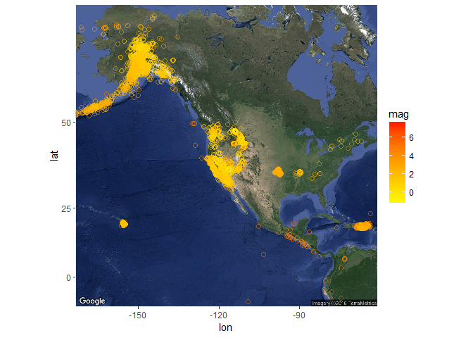

Earthquakes data exploration
================

Data Exploration:
-----------------

### lets check the head of the dataset

    ##                       time latitude longitude depth  mag magType nst gap
    ## 1 2016-03-26T15:28:50.270Z 38.84383 -122.8778  1.84 0.47      md   8 110
    ## 2 2016-03-26T15:19:54.000Z 63.47680 -151.2881  0.00 3.30      ml  NA  NA
    ## 3 2016-03-26T14:11:41.780Z 38.84467 -122.8260  1.60 0.68      md   8 143
    ## 4 2016-03-26T14:06:05.530Z 34.04283 -116.8093 12.35 1.81      ml  72  28
    ## 5 2016-03-26T13:54:57.000Z 60.22340 -151.9723 67.60 2.20      ml  NA  NA
    ## 6 2016-03-26T13:51:55.630Z 38.83450 -122.7932  1.96 1.74      md  30  44
    ##       dmin  rms net         id                  updated
    ## 1 0.007118 0.03  nc nc72613060 2016-03-26T15:45:05.708Z
    ## 2       NA 1.13  ak ak13091455 2016-03-26T15:48:43.942Z
    ## 3 0.009578 0.01  nc nc72613025 2016-03-26T15:04:04.593Z
    ## 4 0.007772 0.17  ci ci37323087 2016-03-26T14:17:10.320Z
    ## 5       NA 0.64  ak ak13090497 2016-03-26T14:43:18.586Z
    ## 6 0.004483 0.03  nc nc72613010 2016-03-26T14:35:26.704Z
    ##                                place       type horizontalError depthError
    ## 1 12km ENE of Cloverdale, California earthquake            0.35       0.46
    ## 2        117km W of Cantwell, Alaska earthquake            0.30       0.30
    ## 3        9km WNW of Cobb, California earthquake            0.43       0.94
    ## 4              14km N of Cabazon, CA earthquake            0.15       0.42
    ## 5          40km WSW of Cohoe, Alaska earthquake            0.40       0.70
    ## 6        6km WNW of Cobb, California earthquake            0.19       0.30
    ##   magError magNst    status locationSource magSource
    ## 1    0.150      2 automatic             nc        nc
    ## 2       NA     NA automatic             ak        ak
    ## 3    0.110      2 automatic             nc        nc
    ## 4    0.137     25 automatic             ci        ci
    ## 5       NA     NA automatic             ak        ak
    ## 6    0.190     10 automatic             nc        nc

as we can see we have 2 datetime columns 12 numeric columns and 8 textual columns
one of the important things we can see is that we have missing values

### lets explore some data statistics

    ## Earthquake_30Days 
    ## 
    ##  22  Variables      8981  Observations
    ## ---------------------------------------------------------------------------
    ## time 
    ##       n missing  unique 
    ##    8981       0    8975 
    ## 
    ## lowest : 2016-02-25T15:52:16.910Z 2016-02-25T15:58:53.000Z 2016-02-25T16:00:46.000Z 2016-02-25T16:04:35.190Z 2016-02-25T16:05:44.801Z
    ## highest: 2016-03-26T13:54:57.000Z 2016-03-26T14:06:05.530Z 2016-03-26T14:11:41.780Z 2016-03-26T15:19:54.000Z 2016-03-26T15:28:50.270Z 
    ## ---------------------------------------------------------------------------
    ## latitude 
    ##       n missing  unique    Info    Mean     .05     .10     .25     .50 
    ##    8981       0    7683       1   41.26   17.99   28.61   36.45   38.80 
    ##     .75     .90     .95 
    ##   53.82   62.65   63.59 
    ## 
    ## lowest : -62.23 -59.75 -59.75 -58.88 -57.76
    ## highest:  69.12  69.33  71.64  85.09  85.11 
    ## ---------------------------------------------------------------------------
    ## longitude 
    ##       n missing  unique    Info    Mean     .05     .10     .25     .50 
    ##    8981       0    7875       1  -117.3 -162.32 -153.14 -148.67 -121.06 
    ##     .75     .90     .95 
    ## -116.94  -98.73  -64.81 
    ## 
    ## lowest : -179.9 -179.9 -179.9 -179.8 -179.8
    ## highest:  179.7  179.7  179.7  179.8  180.0 
    ## ---------------------------------------------------------------------------
    ## depth 
    ##       n missing  unique    Info    Mean     .05     .10     .25     .50 
    ##    8981       0    2995       1    23.5    0.10    1.30    3.03    7.10 
    ##     .75     .90     .95 
    ##   17.08   75.30  105.60 
    ## 
    ## lowest :  -3.41  -3.38  -3.35  -2.83  -2.17
    ## highest: 612.36 615.38 637.27 643.28 672.03 
    ## ---------------------------------------------------------------------------
    ## mag 
    ##       n missing  unique    Info    Mean     .05     .10     .25     .50 
    ##    8919      62     383       1   1.443    0.10    0.30    0.68    1.20 
    ##     .75     .90     .95 
    ##    1.89    2.90    4.30 
    ## 
    ## lowest : -1.4 -1.3 -1.2 -1.1 -1.0, highest:  6.0  6.1  6.3  6.4  7.8 
    ## ---------------------------------------------------------------------------
    ## magType 
    ##       n missing  unique 
    ##    8981       0      15 
    ## 
    ##               mb Mb mb_lg   md  Md mh   ml Ml mw mwb mwc mwp mwr mww
    ## Frequency 62 572  2    97 2408 225  3 5578  1  2   3   1   1  16  10
    ## %          1   6  0     1   27   3  0   62  0  0   0   0   0   0   0
    ## ---------------------------------------------------------------------------
    ## nst 
    ##       n missing  unique    Info    Mean     .05     .10     .25     .50 
    ##    5804    3177      93       1   16.39       4       5       7      11 
    ##     .75     .90     .95 
    ##      21      37      45 
    ## 
    ## lowest :   3   4   5   6   7, highest:  97 112 113 114 121 
    ## ---------------------------------------------------------------------------
    ## gap 
    ##       n missing  unique    Info    Mean     .05     .10     .25     .50 
    ##    6729    2252    1746       1   126.2    43.0    53.0    75.0   114.0 
    ##     .75     .90     .95 
    ##   159.4   225.0   262.2 
    ## 
    ## lowest :  14.0  15.0  17.0  18.0  19.0
    ## highest: 338.0 338.4 342.0 345.6 352.8 
    ## ---------------------------------------------------------------------------
    ## dmin 
    ##        n  missing   unique     Info     Mean      .05      .10      .25 
    ##     6384     2597     4256        1   0.3938 0.005599 0.007848 0.020355 
    ##      .50      .75      .90      .95 
    ## 0.050755 0.147000 0.617399 1.960350 
    ## 
    ## lowest : 2.920e-04 3.902e-04 4.255e-04 5.376e-04 5.610e-04
    ## highest: 2.026e+01 2.086e+01 2.521e+01 3.147e+01 3.629e+01 
    ## ---------------------------------------------------------------------------
    ## rms 
    ##       n missing  unique    Info    Mean     .05     .10     .25     .50 
    ##    8977       4    1149       1  0.2761  0.0200  0.0300  0.0700  0.1575 
    ##     .75     .90     .95 
    ##  0.4400  0.6700  0.8200 
    ## 
    ## lowest : 0.0000 0.0003 0.0006 0.0011 0.0021
    ## highest: 1.5800 1.5900 1.7200 1.8100 1.8500 
    ## ---------------------------------------------------------------------------
    ## net 
    ##       n missing  unique 
    ##    8981       0      14 
    ## 
    ##             ak   ci  hv ismpkansas ld  mb   nc nm   nn  pr se  us  uu  uw
    ## Frequency 2522 1036 222         14  4 171 2026 18 1452 226  4 956 131 199
    ## %           28   12   2          0  0   2   23  0   16   3  0  11   1   2
    ## ---------------------------------------------------------------------------
    ## id 
    ##       n missing  unique 
    ##    8981       0    8981 
    ## 
    ## lowest : ak12881767 ak12881771 ak12881776 ak12881795 ak12882217
    ## highest: uw61133371 uw61133436 uw61133481 uw61133541 uw61133566 
    ## ---------------------------------------------------------------------------
    ## updated 
    ##       n missing  unique 
    ##    8981       0    8981 
    ## 
    ## lowest : 2016-02-25T17:34:06.213Z 2016-02-25T17:47:10.234Z 2016-02-25T18:13:45.928Z 2016-02-25T18:13:49.303Z 2016-02-25T19:17:33.586Z
    ## highest: 2016-03-26T15:24:23.603Z 2016-03-26T15:33:39.979Z 2016-03-26T15:33:42.960Z 2016-03-26T15:45:05.708Z 2016-03-26T15:48:43.942Z 
    ## ---------------------------------------------------------------------------
    ## place 
    ##       n missing  unique 
    ##    8981       0    5084 
    ## 
    ## lowest : 0km E of San Ramon, California     0km ENE of Carson City, Nevada     0km ENE of Loma Linda, California  0km ENE of Quarry near Salinas, CA 0km ENE of The Geysers, California
    ## highest: Southwest of Sumatra, Indonesia    Timor Sea                          West Chile Rise                    West of Macquarie Island           Western Indian-Antarctic Ridge     
    ## ---------------------------------------------------------------------------
    ## type 
    ##       n missing  unique 
    ##    8981       0       4 
    ## 
    ## earthquake (8840, 98%), explosion (35, 0%) 
    ## not reported (2, 0%), quarry blast (104, 1%) 
    ## ---------------------------------------------------------------------------
    ## horizontalError 
    ##       n missing  unique    Info    Mean     .05     .10     .25     .50 
    ##    8972       9     802       1   1.923    0.16    0.20    0.30    0.60 
    ##     .75     .90     .95 
    ##    1.89    5.90    8.50 
    ## 
    ## lowest :   0.09   0.10   0.11   0.12   0.13
    ## highest:  51.70  75.07  78.54  88.11 146.11 
    ## ---------------------------------------------------------------------------
    ## depthError 
    ##       n missing  unique    Info    Mean     .05     .10     .25     .50 
    ##    8766     215     614       1   3.433    0.20    0.27    0.43    0.87 
    ##     .75     .90     .95 
    ##    3.50    8.00   12.50 
    ## 
    ## lowest :   0.00   0.09   0.10   0.11   0.12
    ## highest:  68.70 106.70 136.20 289.70 563.70 
    ## ---------------------------------------------------------------------------
    ## magError 
    ##       n missing  unique    Info    Mean     .05     .10     .25     .50 
    ##    6168    2813     468       1  0.1617  0.0000  0.0200  0.0800  0.1400 
    ##     .75     .90     .95 
    ##  0.2100  0.3053  0.3900 
    ## 
    ## lowest : 0.000 0.001 0.003 0.004 0.006
    ## highest: 1.260 1.270 1.320 1.480 1.510 
    ## ---------------------------------------------------------------------------
    ## magNst 
    ##       n missing  unique    Info    Mean     .05     .10     .25     .50 
    ##    6323    2658     196       1   16.53       1       2       3       7 
    ##     .75     .90     .95 
    ##      17      32      59 
    ## 
    ## lowest :   0   1   2   3   4, highest: 490 494 509 580 724 
    ## ---------------------------------------------------------------------------
    ## status 
    ##       n missing  unique 
    ##    8981       0       2 
    ## 
    ## automatic (988, 11%), reviewed (7993, 89%) 
    ## ---------------------------------------------------------------------------
    ## locationSource 
    ##       n missing  unique 
    ##    8981       0      20 
    ## 
    ## lowest : ak  buc ci  guc hv , highest: se  tul us  uu  uw  
    ## ---------------------------------------------------------------------------
    ## magSource 
    ##       n missing  unique 
    ##    8981       0      19 
    ## 
    ##             ak buc   ci  hv ismp ld lim  mb   nc nm   nn oh ott  pr se tul
    ## Frequency 2547   1 1036 222   16  4   1 174 2026 18 1453  1   2 226  4  39
    ## %           28   0   12   2    0  0   0   2   23  0   16  0   0   3  0   0
    ##            us  uu  uw
    ## Frequency 881 131 199
    ## %          10   1   2
    ## ---------------------------------------------------------------------------

we can see there are some columns that contains many missing values such as 'nst', 'gap', 'dmin, 'magError' and 'magNst' i will omit those columns and remove rows with missing data on the rest of the data so i can have clean data to work with and also filter the non earthquake records

Data Description:
-----------------

the data is about earthquakes telemetry which includes the location of the activity, the manitude, depth etc.
as i see it the most relevant data attributes are the location represented by latitude and longtitude, the manitude, depth and rms(the root mean square of the travel time residual) and the location source.
i will explore the relation of those attributes

Data Analysis:
--------------

### check correlation in the data columns

### graphs of the more "relevant" columns and compared to each other

### trend i see in the graphs

### try to do regression on some of the columns

Map/s from the data:
--------------------

<!-- --> in the map we can see that most of the earthquakes are in the bounderies between continents and espacially in the "ring of fire" which is around the pacific ocean

Summary and Recommendations:
----------------------------
