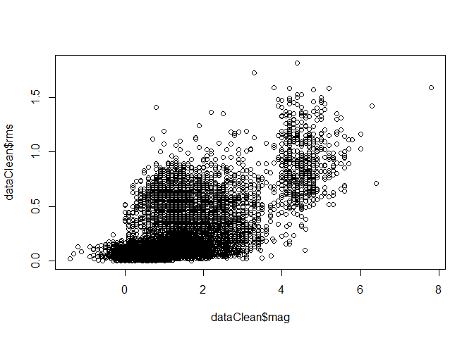

Earthquakes data exploration
================

Data Exploration:
-----------------

### lets check the head of the dataset

    ##                       time latitude longitude  depth  mag magType nst gap
    ## 1 2016-03-27T16:18:29.180Z 33.40767 -116.6085   5.46 0.61      ml  23  82
    ## 2 2016-03-27T16:04:05.000Z 59.54310 -152.8073  69.40 1.60      ml  NA  NA
    ## 3 2016-03-27T16:00:59.740Z 36.01450 -120.5742   2.74 0.84      md  12 124
    ## 4 2016-03-27T15:56:28.000Z 63.06750 -151.7164   1.70 1.40      ml  NA  NA
    ## 5 2016-03-27T15:48:27.820Z 14.99510  -94.6132  29.47 4.90      mb  NA 153
    ## 6 2016-03-27T15:42:20.000Z 59.75310 -153.1117 104.60 2.90      ml  NA  NA
    ##      dmin  rms net         id                  updated
    ## 1 0.06836 0.11  ci ci37323479 2016-03-27T16:23:10.676Z
    ## 2      NA 0.72  ak ak13105204 2016-03-27T16:36:35.528Z
    ## 3 0.03087 0.05  nc nc72613510 2016-03-27T16:30:06.806Z
    ## 4      NA 0.58  ak ak13105202 2016-03-27T16:36:36.772Z
    ## 5 2.70700 0.70  us us20005cqq 2016-03-27T16:08:26.742Z
    ## 6      NA 0.57  ak ak13104206 2016-03-27T16:37:23.504Z
    ##                                      place       type horizontalError
    ## 1             14km N of Warner Springs, CA earthquake            0.22
    ## 2         60km WSW of Anchor Point, Alaska earthquake            0.40
    ## 3          23km SW of Coalinga, California earthquake            0.39
    ## 4            116km NW of Talkeetna, Alaska earthquake            0.50
    ## 5 137km S of San Francisco del Mar, Mexico earthquake            8.60
    ## 6           71km W of Anchor Point, Alaska earthquake            0.60
    ##   depthError magError magNst    status locationSource magSource
    ## 1       0.57    0.106     18 automatic             ci        ci
    ## 2       0.60       NA     NA automatic             ak        ak
    ## 3       0.99    0.440      5 automatic             nc        nc
    ## 4       0.50       NA     NA automatic             ak        ak
    ## 5       4.20    0.030    347  reviewed             us        us
    ## 6       0.60       NA     NA automatic             ak        ak

as we can see we have 2 datetime columns 12 numeric columns and 8 textual columns
one of the important things we can see is that we have missing values

### lets explore some data statistics

    ## Earthquake_30Days 
    ## 
    ##  22  Variables      8900  Observations
    ## ---------------------------------------------------------------------------
    ## time 
    ##       n missing  unique 
    ##    8900       0    8894 
    ## 
    ## lowest : 2016-02-26T16:46:32.000Z 2016-02-26T16:49:12.703Z 2016-02-26T17:01:42.320Z 2016-02-26T17:01:53.000Z 2016-02-26T17:11:39.200Z
    ## highest: 2016-03-27T15:48:27.820Z 2016-03-27T15:56:28.000Z 2016-03-27T16:00:59.740Z 2016-03-27T16:04:05.000Z 2016-03-27T16:18:29.180Z 
    ## ---------------------------------------------------------------------------
    ## latitude 
    ##       n missing  unique    Info    Mean     .05     .10     .25     .50 
    ##    8900       0    7584       1   41.25   17.99   29.64   36.45   38.80 
    ##     .75     .90     .95 
    ##   53.71   62.70   63.60 
    ## 
    ## lowest : -59.75 -59.75 -58.88 -57.76 -57.49
    ## highest:  69.12  69.33  71.64  85.09  85.11 
    ## ---------------------------------------------------------------------------
    ## longitude 
    ##       n missing  unique    Info    Mean     .05     .10     .25     .50 
    ##    8900       0    7787       1    -117 -161.65 -153.09 -148.54 -120.81 
    ##     .75     .90     .95 
    ## -116.95  -98.69  -64.78 
    ## 
    ## lowest : -179.9 -179.9 -179.9 -179.8 -179.8
    ## highest:  179.7  179.7  179.7  179.8  180.0 
    ## ---------------------------------------------------------------------------
    ## depth 
    ##       n missing  unique    Info    Mean     .05     .10     .25     .50 
    ##    8900       0    2955       1    23.3   0.099   1.290   3.009   7.085 
    ##     .75     .90     .95 
    ##  16.872  75.010 105.643 
    ## 
    ## lowest :  -3.41  -3.38  -3.35  -2.83  -2.21
    ## highest: 612.36 615.38 637.27 643.28 672.03 
    ## ---------------------------------------------------------------------------
    ## mag 
    ##       n missing  unique    Info    Mean     .05     .10     .25     .50 
    ##    8839      61     385       1   1.441    0.10    0.30    0.67    1.20 
    ##     .75     .90     .95 
    ##    1.88    2.90    4.30 
    ## 
    ## lowest : -1.4 -1.3 -1.2 -1.1 -0.9, highest:  6.0  6.1  6.3  6.4  7.8 
    ## ---------------------------------------------------------------------------
    ## magType 
    ##       n missing  unique 
    ##    8900       0      15 
    ## 
    ##               mb Mb mb_lg   md  Md mh   ml Ml mw mwb mwc mwp mwr mww
    ## Frequency 61 575  2    98 2360 222  3 5546  1  2   2   1   1  17   9
    ## %          1   6  0     1   27   2  0   62  0  0   0   0   0   0   0
    ## ---------------------------------------------------------------------------
    ## nst 
    ##       n missing  unique    Info    Mean     .05     .10     .25     .50 
    ##    5756    3144      92       1   16.33       4       5       7      11 
    ##     .75     .90     .95 
    ##      21      37      45 
    ## 
    ## lowest :   3   4   5   6   7, highest:  96  97 112 113 121 
    ## ---------------------------------------------------------------------------
    ## gap 
    ##       n missing  unique    Info    Mean     .05     .10     .25     .50 
    ##    6678    2222    1755       1   125.8    43.0    53.0    75.0   114.0 
    ##     .75     .90     .95 
    ##   158.0   223.2   261.3 
    ## 
    ## lowest :  14.0  15.0  17.0  18.0  19.0
    ## highest: 338.4 342.0 345.0 345.6 352.8 
    ## ---------------------------------------------------------------------------
    ## dmin 
    ##        n  missing   unique     Info     Mean      .05      .10      .25 
    ##     6333     2567     4200        1   0.3898 0.005530 0.007847 0.020180 
    ##      .50      .75      .90      .95 
    ## 0.050000 0.146100 0.613400 1.955400 
    ## 
    ## lowest : 2.920e-04 3.902e-04 4.255e-04 5.376e-04 5.610e-04
    ## highest: 2.016e+01 2.026e+01 2.521e+01 3.147e+01 3.629e+01 
    ## ---------------------------------------------------------------------------
    ## rms 
    ##       n missing  unique    Info    Mean     .05     .10     .25     .50 
    ##    8891       9    1144       1   0.277  0.0200  0.0300  0.0700  0.1575 
    ##     .75     .90     .95 
    ##  0.4400  0.6800  0.8300 
    ## 
    ## lowest : 0.0000 0.0003 0.0006 0.0011 0.0021
    ## highest: 1.5800 1.5900 1.7200 1.8100 1.8500 
    ## ---------------------------------------------------------------------------
    ## net 
    ##       n missing  unique 
    ##    8900       0      14 
    ## 
    ##             ak   ci  hv ismpkansas ld  mb   nc nm   nn  pr se  us  uu  uw
    ## Frequency 2492 1039 215         14  4 160 1990 18 1469 223  4 953 124 195
    ## %           28   12   2          0  0   2   22  0   17   3  0  11   1   2
    ## ---------------------------------------------------------------------------
    ## id 
    ##       n missing  unique 
    ##    8900       0    8900 
    ## 
    ## lowest : ak12888989 ak12888993 ak12889514 ak12889518 ak12890032
    ## highest: uw61133371 uw61133436 uw61133481 uw61133541 uw61133566 
    ## ---------------------------------------------------------------------------
    ## updated 
    ##       n missing  unique 
    ##    8900       0    8900 
    ## 
    ## lowest : 2016-02-26T17:54:04.366Z 2016-02-26T18:43:52.060Z 2016-02-26T18:58:45.591Z 2016-02-26T19:44:32.185Z 2016-02-26T19:54:19.515Z
    ## highest: 2016-03-27T16:32:23.869Z 2016-03-27T16:35:32.366Z 2016-03-27T16:36:35.528Z 2016-03-27T16:36:36.772Z 2016-03-27T16:37:23.504Z 
    ## ---------------------------------------------------------------------------
    ## place 
    ##       n missing  unique 
    ##    8900       0    5015 
    ## 
    ## lowest : 0km E of San Ramon, California     0km ENE of Carson City, Nevada     0km ENE of Loma Linda, California  0km ENE of Quarry near Salinas, CA 0km ENE of The Geysers, California
    ## highest: Southwest of Sumatra, Indonesia    Timor Sea                          West Chile Rise                    West of Macquarie Island           Western Indian-Antarctic Ridge     
    ## ---------------------------------------------------------------------------
    ## type 
    ##       n missing  unique 
    ##    8900       0       4 
    ## 
    ## earthquake (8766, 98%), explosion (33, 0%) 
    ## not reported (2, 0%), quarry blast (99, 1%) 
    ## ---------------------------------------------------------------------------
    ## horizontalError 
    ##       n missing  unique    Info    Mean     .05     .10     .25     .50 
    ##    8886      14     795       1   1.918    0.16    0.20    0.30    0.60 
    ##     .75     .90     .95 
    ##    1.90    5.90    8.50 
    ## 
    ## lowest :   0.09   0.10   0.11   0.12   0.13
    ## highest:  51.70  75.07  78.54  88.11 146.11 
    ## ---------------------------------------------------------------------------
    ## depthError 
    ##       n missing  unique    Info    Mean     .05     .10     .25     .50 
    ##    8680     220     609       1   3.433    0.20    0.27    0.44    0.88 
    ##     .75     .90     .95 
    ##    3.60    8.00   12.30 
    ## 
    ## lowest :   0.00   0.09   0.10   0.11   0.12
    ## highest: 106.70 113.50 136.20 289.70 563.70 
    ## ---------------------------------------------------------------------------
    ## magError 
    ##       n missing  unique    Info    Mean     .05     .10     .25     .50 
    ##    6123    2777     465       1   0.161  0.0000  0.0200  0.0790  0.1400 
    ##     .75     .90     .95 
    ##  0.2100  0.3058  0.3900 
    ## 
    ## lowest : 0.000 0.001 0.003 0.004 0.006
    ## highest: 1.260 1.270 1.320 1.480 1.510 
    ## ---------------------------------------------------------------------------
    ## magNst 
    ##       n missing  unique    Info    Mean     .05     .10     .25     .50 
    ##    6271    2629     196       1   16.61       1       2       3       7 
    ##     .75     .90     .95 
    ##      17      32      59 
    ## 
    ## lowest :   0   1   2   3   4, highest: 490 494 509 580 724 
    ## ---------------------------------------------------------------------------
    ## status 
    ##       n missing  unique 
    ##    8900       0       2 
    ## 
    ## automatic (1095, 12%), reviewed (7805, 88%) 
    ## ---------------------------------------------------------------------------
    ## locationSource 
    ##       n missing  unique 
    ##    8900       0      20 
    ## 
    ## lowest : ak  buc ci  guc hv , highest: se  tul us  uu  uw  
    ## ---------------------------------------------------------------------------
    ## magSource 
    ##       n missing  unique 
    ##    8900       0      19 
    ## 
    ##             ak buc   ci  hv ismp ld lim  mb   nc nm   nn oh ott  pr se tul
    ## Frequency 2516   1 1039 215   16  4   1 161 1990 18 1470  1   2 223  4  38
    ## %           28   0   12   2    0  0   0   2   22  0   17  0   0   3  0   0
    ##            us  uu  uw
    ## Frequency 882 124 195
    ## %          10   1   2
    ## ---------------------------------------------------------------------------

we can see there are some columns that contains many missing values such as 'nst', 'gap', 'dmin, 'magError' and 'magNst' i will omit those columns and remove rows with missing data on the rest of the data so i can have clean data to work with and also filter the non earthquake records

Data Description:
-----------------

the data is about earthquakes telemetry which includes the location of the activity, the manitude, depth etc.
as i see it the most relevant data attributes are the location represented by latitude and longitude, the manitude, depth and rms(the root mean square of the travel time residual) and the location source.
i will explore the relation of those attributes

Data Analysis:
--------------

### check correlation in the data columns

    ##                    latitude   longitude       depth         mag        rms
    ## latitude         1.00000000 -0.55292342 -0.11844421 -0.38676247 0.04127045
    ## longitude       -0.55292342  1.00000000  0.12273852  0.50891543 0.26950151
    ## depth           -0.11844421  0.12273852  1.00000000  0.40648913 0.38025673
    ## mag             -0.38676247  0.50891543  0.40648913  1.00000000 0.65110850
    ## rms              0.04127045  0.26950151  0.38025673  0.65110850 1.00000000
    ## horizontalError -0.34802903  0.37507046  0.26993445  0.36875933 0.27100070
    ## depthError      -0.10154981  0.08884075  0.03589155  0.04896111 0.03125174
    ##                 horizontalError  depthError
    ## latitude             -0.3480290 -0.10154981
    ## longitude             0.3750705  0.08884075
    ## depth                 0.2699345  0.03589155
    ## mag                   0.3687593  0.04896111
    ## rms                   0.2710007  0.03125174
    ## horizontalError       1.0000000  0.30863526
    ## depthError            0.3086353  1.00000000

we can see that the rms and magnitude have the highest correlation which we could expect because it make sense that big earthquakes will move faster or be noticed faster then small ones.
but still none of the correlation can be addressed as something out of the ordinary

### graphs of the more "relevant" columns and compared to each other

let look at some of the magnitude statistics we can see that the median is about 1 and the variance is lower then 2
so we can conclude that most of the earthquakes aren't noticable <!-- -->

lets look on who first reported the events based on the magnitude
<!-- -->

we can see the the us station reported the strongest event and has one of the highest median of the events magnitude which is alot higher then the global median of the magnitude.

let's look at location colusters of earthquakes
<!-- -->

we can see several of clusters in the top left of the map. let look which place is that.
<!-- -->

we can see it's north america around san fransisco which is known for it's earthquakes
<!-- -->

also we can see that most of the earthquakes are focused around the "ring of fire" which is around the pacific ocean and known to be with alot of earthquakes and active volcanoes.
event thought there are alot of earthquakes in north america it looks like the more aggressive ones are in south-east asia

let look at the relation of magnitude and RMS
<!-- -->

we can see a trend up in the RMS as the earthquake was stronger as we expect

let look as the relation of magnitude and the depth of the event
<!-- -->

here we can see something interesting, only earthquakes with magnitude of 4+ has been in big depth which indicate more massive or aggressive movment of the continents

lets check if there is some hour where earthquakes occure more frequently
<!-- -->

we can see that around midnight there are little more earthquakes \#\# Summary and Recommendations:
