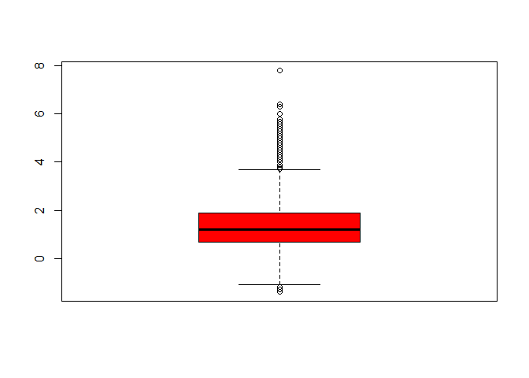

Earthquakes data exploration
================

Data Exploration:
-----------------

### lets check the head of the dataset

    ##                       time latitude longitude  depth  mag magType nst
    ## 1 2016-03-27T15:17:18.450Z 38.81967 -122.7983   2.07 0.61      md  10
    ## 2 2016-03-27T15:04:11.710Z 38.84133 -122.8418   1.22 0.91      md  12
    ## 3 2016-03-27T14:51:51.000Z 59.88740 -152.7941  82.60 2.20      ml  NA
    ## 4 2016-03-27T14:35:29.000Z 62.98280 -150.6213 109.50 1.50      ml  NA
    ## 5 2016-03-27T14:33:42.380Z 30.40170 -114.2536  10.00 4.40      mb  NA
    ## 6 2016-03-27T14:30:26.050Z 38.66280 -119.5725  11.70 1.40      ml   8
    ##      gap     dmin    rms net         id                  updated
    ## 1  81.00 0.011920 0.0200  nc nc72613500 2016-03-27T15:28:25.633Z
    ## 2 195.00 0.005664 0.0500  nc nc72613495 2016-03-27T15:21:10.609Z
    ## 3     NA       NA 0.9800  ak ak13104198 2016-03-27T15:23:37.054Z
    ## 4     NA       NA 0.2400  ak ak13103218 2016-03-27T15:23:36.435Z
    ## 5 156.00 0.816000 1.1100  us us20005cqe 2016-03-27T14:52:51.429Z
    ## 6 191.32 0.414000 0.0481  nn nn00537778 2016-03-27T15:08:19.009Z
    ##                               place       type horizontalError depthError
    ## 1 5km NW of The Geysers, California earthquake            0.26       0.67
    ## 2      10km WNW of Cobb, California earthquake            0.51       0.51
    ## 3  55km WNW of Anchor Point, Alaska earthquake            0.70       0.90
    ## 4     77km NNW of Talkeetna, Alaska earthquake            0.50       0.90
    ## 5     88km SE of San Felipe, Mexico earthquake            4.10       1.90
    ## 6   23km SW of Smith Valley, Nevada earthquake            4.27       5.30
    ##   magError magNst    status locationSource magSource
    ## 1    0.190      5 automatic             nc        nc
    ## 2    0.120      5 automatic             nc        nc
    ## 3       NA     NA automatic             ak        ak
    ## 4       NA     NA automatic             ak        ak
    ## 5    0.075     52  reviewed             us        us
    ## 6    0.000      1  reviewed             nn        nn

as we can see we have 2 datetime columns 12 numeric columns and 8 textual columns
one of the important things we can see is that we have missing values

### lets explore some data statistics

    ## Earthquake_30Days 
    ## 
    ##  22  Variables      8892  Observations
    ## ---------------------------------------------------------------------------
    ## time 
    ##       n missing  unique 
    ##    8892       0    8886 
    ## 
    ## lowest : 2016-02-26T15:32:35.870Z 2016-02-26T15:37:33.210Z 2016-02-26T15:59:26.600Z 2016-02-26T16:09:07.000Z 2016-02-26T16:23:51.042Z
    ## highest: 2016-03-27T14:33:42.380Z 2016-03-27T14:35:29.000Z 2016-03-27T14:51:51.000Z 2016-03-27T15:04:11.710Z 2016-03-27T15:17:18.450Z 
    ## ---------------------------------------------------------------------------
    ## latitude 
    ##       n missing  unique    Info    Mean     .05     .10     .25     .50 
    ##    8892       0    7577       1   41.25   17.99   29.65   36.45   38.80 
    ##     .75     .90     .95 
    ##   53.71   62.69   63.60 
    ## 
    ## lowest : -59.75 -59.75 -58.88 -57.76 -57.49
    ## highest:  69.12  69.33  71.64  85.09  85.11 
    ## ---------------------------------------------------------------------------
    ## longitude 
    ##       n missing  unique    Info    Mean     .05     .10     .25     .50 
    ##    8892       0    7780       1  -116.9 -161.76 -153.09 -148.54 -120.83 
    ##     .75     .90     .95 
    ## -116.95  -98.69  -64.77 
    ## 
    ## lowest : -179.9 -179.9 -179.9 -179.8 -179.8
    ## highest:  179.7  179.7  179.7  179.8  180.0 
    ## ---------------------------------------------------------------------------
    ## depth 
    ##       n missing  unique    Info    Mean     .05     .10     .25     .50 
    ##    8892       0    2953       1   23.31   0.091   1.290   3.004   7.078 
    ##     .75     .90     .95 
    ##  16.872  75.000 105.667 
    ## 
    ## lowest :  -3.41  -3.38  -3.35  -2.83  -2.21
    ## highest: 612.36 615.38 637.27 643.28 672.03 
    ## ---------------------------------------------------------------------------
    ## mag 
    ##       n missing  unique    Info    Mean     .05     .10     .25     .50 
    ##    8831      61     385       1   1.441    0.10    0.30    0.67    1.20 
    ##     .75     .90     .95 
    ##    1.88    2.90    4.30 
    ## 
    ## lowest : -1.4 -1.3 -1.2 -1.1 -0.9, highest:  6.0  6.1  6.3  6.4  7.8 
    ## ---------------------------------------------------------------------------
    ## magType 
    ##       n missing  unique 
    ##    8892       0      15 
    ## 
    ##               mb Mb mb_lg   md  Md mh   ml Ml mw mwb mwc mwp mwr mww
    ## Frequency 61 574  2    98 2360 222  3 5539  1  2   2   1   1  17   9
    ## %          1   6  0     1   27   2  0   62  0  0   0   0   0   0   0
    ## ---------------------------------------------------------------------------
    ## nst 
    ##       n missing  unique    Info    Mean     .05     .10     .25     .50 
    ##    5751    3141      92       1   16.35       4       5       7      11 
    ##     .75     .90     .95 
    ##      21      37      45 
    ## 
    ## lowest :   3   4   5   6   7, highest:  96  97 112 113 121 
    ## ---------------------------------------------------------------------------
    ## gap 
    ##       n missing  unique    Info    Mean     .05     .10     .25     .50 
    ##    6672    2220    1751       1   125.8    43.0    53.0    75.0   114.0 
    ##     .75     .90     .95 
    ##   158.0   223.3   261.6 
    ## 
    ## lowest :  14.0  15.0  17.0  18.0  19.0
    ## highest: 338.4 342.0 345.0 345.6 352.8 
    ## ---------------------------------------------------------------------------
    ## dmin 
    ##        n  missing   unique     Info     Mean      .05      .10      .25 
    ##     6327     2565     4198        1   0.3892 0.005528 0.007842 0.020085 
    ##      .50      .75      .90      .95 
    ## 0.050000 0.146200 0.612200 1.949800 
    ## 
    ## lowest : 2.920e-04 3.902e-04 4.255e-04 5.376e-04 5.610e-04
    ## highest: 2.016e+01 2.026e+01 2.521e+01 3.147e+01 3.629e+01 
    ## ---------------------------------------------------------------------------
    ## rms 
    ##       n missing  unique    Info    Mean     .05     .10     .25     .50 
    ##    8882      10    1142       1  0.2771  0.0200  0.0300  0.0700  0.1579 
    ##     .75     .90     .95 
    ##  0.4400  0.6800  0.8300 
    ## 
    ## lowest : 0.0000 0.0003 0.0006 0.0011 0.0021
    ## highest: 1.5800 1.5900 1.7200 1.8100 1.8500 
    ## ---------------------------------------------------------------------------
    ## net 
    ##       n missing  unique 
    ##    8892       0      14 
    ## 
    ##             ak   ci  hv ismpkansas ld  mb   nc nm   nn  pr se  us  uu  uw
    ## Frequency 2490 1039 215         14  4 160 1990 18 1465 223  4 952 124 194
    ## %           28   12   2          0  0   2   22  0   16   3  0  11   1   2
    ## ---------------------------------------------------------------------------
    ## id 
    ##       n missing  unique 
    ##    8892       0    8892 
    ## 
    ## lowest : ak12888988 ak12888989 ak12888993 ak12889514 ak12889518
    ## highest: uw61133371 uw61133436 uw61133481 uw61133541 uw61133566 
    ## ---------------------------------------------------------------------------
    ## updated 
    ##       n missing  unique 
    ##    8892       0    8892 
    ## 
    ## lowest : 2016-02-26T16:41:17.704Z 2016-02-26T17:54:04.366Z 2016-02-26T18:43:52.060Z 2016-02-26T18:58:45.591Z 2016-02-26T19:44:32.185Z
    ## highest: 2016-03-27T15:23:45.159Z 2016-03-27T15:23:49.694Z 2016-03-27T15:26:30.490Z 2016-03-27T15:28:25.633Z 2016-03-27T15:28:48.653Z 
    ## ---------------------------------------------------------------------------
    ## place 
    ##       n missing  unique 
    ##    8892       0    5013 
    ## 
    ## lowest : 0km E of San Ramon, California     0km ENE of Carson City, Nevada     0km ENE of Loma Linda, California  0km ENE of Quarry near Salinas, CA 0km ENE of The Geysers, California
    ## highest: Southwest of Sumatra, Indonesia    Timor Sea                          West Chile Rise                    West of Macquarie Island           Western Indian-Antarctic Ridge     
    ## ---------------------------------------------------------------------------
    ## type 
    ##       n missing  unique 
    ##    8892       0       4 
    ## 
    ## earthquake (8758, 98%), explosion (33, 0%) 
    ## not reported (2, 0%), quarry blast (99, 1%) 
    ## ---------------------------------------------------------------------------
    ## horizontalError 
    ##       n missing  unique    Info    Mean     .05     .10     .25     .50 
    ##    8877      15     796       1   1.919    0.16    0.20    0.30    0.60 
    ##     .75     .90     .95 
    ##    1.90    5.90    8.50 
    ## 
    ## lowest :   0.09   0.10   0.11   0.12   0.13
    ## highest:  51.70  75.07  78.54  88.11 146.11 
    ## ---------------------------------------------------------------------------
    ## depthError 
    ##       n missing  unique    Info    Mean     .05     .10     .25     .50 
    ##    8671     221     610       1   3.437    0.20    0.27    0.44    0.88 
    ##     .75     .90     .95 
    ##    3.60    8.00   12.30 
    ## 
    ## lowest :   0.00   0.09   0.10   0.11   0.12
    ## highest: 106.70 113.50 136.20 289.70 563.70 
    ## ---------------------------------------------------------------------------
    ## magError 
    ##       n missing  unique    Info    Mean     .05     .10     .25     .50 
    ##    6116    2776     465       1   0.161  0.0000  0.0200  0.0790  0.1395 
    ##     .75     .90     .95 
    ##  0.2100  0.3055  0.3900 
    ## 
    ## lowest : 0.000 0.001 0.003 0.004 0.006
    ## highest: 1.260 1.270 1.320 1.480 1.510 
    ## ---------------------------------------------------------------------------
    ## magNst 
    ##       n missing  unique    Info    Mean     .05     .10     .25     .50 
    ##    6264    2628     195       1   16.57       1       2       3       7 
    ##     .75     .90     .95 
    ##      17      32      59 
    ## 
    ## lowest :   0   1   2   3   4, highest: 490 494 509 580 724 
    ## ---------------------------------------------------------------------------
    ## status 
    ##       n missing  unique 
    ##    8892       0       2 
    ## 
    ## automatic (1090, 12%), reviewed (7802, 88%) 
    ## ---------------------------------------------------------------------------
    ## locationSource 
    ##       n missing  unique 
    ##    8892       0      20 
    ## 
    ## lowest : ak  buc ci  guc hv , highest: se  tul us  uu  uw  
    ## ---------------------------------------------------------------------------
    ## magSource 
    ##       n missing  unique 
    ##    8892       0      19 
    ## 
    ##             ak buc   ci  hv ismp ld lim  mb   nc nm   nn oh ott  pr se tul
    ## Frequency 2514   1 1039 215   16  4   1 161 1990 18 1466  1   2 223  4  38
    ## %           28   0   12   2    0  0   0   2   22  0   16  0   0   3  0   0
    ##            us  uu  uw
    ## Frequency 881 124 194
    ## %          10   1   2
    ## ---------------------------------------------------------------------------

we can see there are some columns that contains many missing values such as 'nst', 'gap', 'dmin, 'magError' and 'magNst' i will omit those columns and remove rows with missing data on the rest of the data so i can have clean data to work with and also filter the non earthquake records

Data Description:
-----------------

the data is about earthquakes telemetry which includes the location of the activity, the manitude, depth etc.
as i see it the most relevant data attributes are the location represented by latitude and longitude, the manitude, depth and rms(the root mean square of the travel time residual) and the location source.
i will explore the relation of those attributes

Data Analysis:
--------------

### check correlation in the data columns

    ##                    latitude   longitude       depth         mag        rms
    ## latitude         1.00000000 -0.55343550 -0.11748187 -0.38611592 0.04113917
    ## longitude       -0.55343550  1.00000000  0.12227010  0.50931502 0.27066293
    ## depth           -0.11748187  0.12227010  1.00000000  0.40623491 0.37960842
    ## mag             -0.38611592  0.50931502  0.40623491  1.00000000 0.65128914
    ## rms              0.04113917  0.27066293  0.37960842  0.65128914 1.00000000
    ## horizontalError -0.34652230  0.37420000  0.26933259  0.36770155 0.27088872
    ## depthError      -0.10133359  0.08874914  0.03581346  0.04872162 0.03148527
    ##                 horizontalError  depthError
    ## latitude             -0.3465223 -0.10133359
    ## longitude             0.3742000  0.08874914
    ## depth                 0.2693326  0.03581346
    ## mag                   0.3677016  0.04872162
    ## rms                   0.2708887  0.03148527
    ## horizontalError       1.0000000  0.30972066
    ## depthError            0.3097207  1.00000000

we can see that the rms and magnitude have the highest correlation which we could expect because it make sense that big earthquakes will move faster or be noticed faster then small ones.
but still none of the correlation can be addressed as something out of the ordinary

### graphs of the more "relevant" columns and compared to each other

let look at some of the magnitude statistics we can see that the median is about 1 and the variance is lower then 2
so we can conclude that most of the earthquakes aren't noticable <!-- -->

lets look on who first reported the events based on the magnitude
<!-- -->

we can see the the us station reported the strongest event and has one of the highest median of the events magnitude which is alot higher then the global median of the magnitude.

let's look at location colusters of earthquakes
<!-- -->

we can see several of clusters in the top left of the map. let look which place is that.
<!-- -->

we can see it's north america around san fransisco which is known for it's earthquakes

<!-- -->

also we can see that most of the earthquakes are focused around the "ring of fire" which is around the pacific ocean and known to be with alot of earthquakes and active volcanoes.
event thought there are alot of earthquakes in north america it looks like the more aggressive ones are in south-east asia

### try to do regression on some of the columns

Summary and Recommendations:
----------------------------
