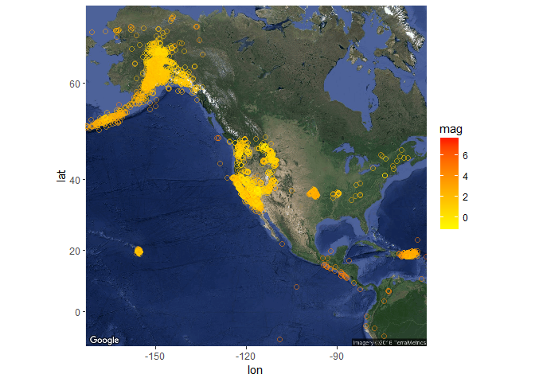

Earthquakes data exploration
================

Data Exploration:
-----------------

### lets check the head of the dataset

    ##                       time latitude longitude  depth  mag magType nst
    ## 1 2016-03-22T12:48:15.750Z 52.01520  157.6122 118.85 4.40      mb  NA
    ## 2 2016-03-22T12:43:06.790Z 38.80850 -122.8255   1.75 1.25      md  12
    ## 3 2016-03-22T12:35:33.670Z 38.65620 -118.7850  10.80 2.80      ml  31
    ## 4 2016-03-22T12:27:35.410Z 34.03550 -117.5217   3.34 0.81      ml  16
    ## 5 2016-03-22T11:52:46.460Z 33.37333 -116.3992  10.71 1.19      ml  39
    ## 6 2016-03-22T11:44:16.270Z 38.82333 -122.8250   0.50 1.01      md   5
    ##      gap     dmin  rms net         id                  updated
    ## 1 165.00 1.096000 0.82  us us20005bpu 2016-03-22T13:15:42.486Z
    ## 2 138.00 0.002897 0.02  nc nc72610940 2016-03-22T13:07:06.729Z
    ## 3  61.81 0.415000   NA  nn nn00536848 2016-03-22T12:55:04.464Z
    ## 4  56.00 0.045290 0.19  ci ci37538464 2016-03-22T12:32:21.545Z
    ## 5  51.00 0.105900 0.19  ci ci37538456 2016-03-22T13:36:46.775Z
    ## 6 151.00 0.007840 0.00  nc nc72610920 2016-03-22T12:40:06.425Z
    ##                                   place       type horizontalError
    ## 1        94km NE of Ozernovskiy, Russia earthquake           10.50
    ## 2    6km WNW of The Geysers, California earthquake            0.54
    ## 3          20km NW of Hawthorne, Nevada earthquake              NA
    ## 4       4km NW of Glen Avon, California earthquake            0.35
    ## 5 13km N of Borrego Springs, California earthquake            0.24
    ## 6     7km NW of The Geysers, California earthquake            1.74
    ##   depthError magError magNst    status locationSource magSource
    ## 1       7.10    0.062     75  reviewed             us        us
    ## 2       0.48    0.160      4 automatic             nc        nc
    ## 3         NA       NA     NA automatic             nn        nn
    ## 4       0.65    0.234     13 automatic             ci        ci
    ## 5       0.48    0.151     26  reviewed             ci        ci
    ## 6       1.65       NA      3 automatic             nc        nc

as we can see we have 2 datetime columns 12 numeric columns and 8 textual columns
one of the important things we can see is that we have missing values

### lets explore some data statistics

    ## Earthquake_30Days 
    ## 
    ##  22  Variables      8778  Observations
    ## ---------------------------------------------------------------------------
    ## time 
    ##       n missing  unique 
    ##    8778       0    8772 
    ## 
    ## lowest : 2016-02-21T13:37:38.380Z 2016-02-21T13:39:58.000Z 2016-02-21T13:48:16.000Z 2016-02-21T13:52:15.000Z 2016-02-21T13:56:56.440Z
    ## highest: 2016-03-22T11:52:46.460Z 2016-03-22T12:27:35.410Z 2016-03-22T12:35:33.670Z 2016-03-22T12:43:06.790Z 2016-03-22T12:48:15.750Z 
    ## ---------------------------------------------------------------------------
    ## latitude 
    ##       n missing  unique    Info    Mean     .05     .10     .25     .50 
    ##    8778       0    7646       1   40.91   17.99   20.82   36.33   38.80 
    ##     .75     .90     .95 
    ##   52.80   62.32   63.53 
    ## 
    ## lowest : -63.04 -62.99 -62.23 -59.75 -58.88
    ## highest:  69.17  69.33  71.64  85.09  85.11 
    ## ---------------------------------------------------------------------------
    ## longitude 
    ##       n missing  unique    Info    Mean     .05     .10     .25     .50 
    ##    8778       0    7805       1  -116.9 -162.08 -153.15 -148.39 -121.02 
    ##     .75     .90     .95 
    ## -116.74  -97.98  -64.75 
    ## 
    ## lowest : -179.9 -179.9 -179.9 -179.9 -179.9
    ## highest:  179.6  179.7  179.7  179.8  179.8 
    ## ---------------------------------------------------------------------------
    ## depth 
    ##       n missing  unique    Info    Mean     .05     .10     .25     .50 
    ##    8778       0    3024       1   23.73    0.14    1.27    2.94    7.33 
    ##     .75     .90     .95 
    ##   17.43   75.20  105.61 
    ## 
    ## lowest :  -3.41  -3.38  -3.35  -2.83  -2.37
    ## highest: 607.32 612.36 615.38 637.27 672.03 
    ## ---------------------------------------------------------------------------
    ## mag 
    ##       n missing  unique    Info    Mean     .05     .10     .25     .50 
    ##    8729      49     392       1    1.49    0.10    0.30    0.71    1.29 
    ##     .75     .90     .95 
    ##    1.90    3.00    4.30 
    ## 
    ## lowest : -1.4 -1.3 -1.2 -1.1 -1.0, highest:  6.0  6.1  6.3  6.4  7.8 
    ## ---------------------------------------------------------------------------
    ## magType 
    ##       n missing  unique 
    ##    8778       0      15 
    ## 
    ##               mb Mb mb_lg   md  Md mh   ml Ml mw mwb mwc mwp mwr mww
    ## Frequency 49 566  2   109 2486 230  4 5290  2  3   4   1   2  19  11
    ## %          1   6  0     1   28   3  0   60  0  0   0   0   0   0   0
    ## ---------------------------------------------------------------------------
    ## nst 
    ##       n missing  unique    Info    Mean     .05     .10     .25     .50 
    ##    5554    3224      96       1   17.09       4       5       7      12 
    ##     .75     .90     .95 
    ##      22      37      46 
    ## 
    ## lowest :   3   4   5   6   7, highest: 100 112 113 114 121 
    ## ---------------------------------------------------------------------------
    ## gap 
    ##       n missing  unique    Info    Mean     .05     .10     .25     .50 
    ##    6514    2264    1599       1   126.1    42.0    52.0    74.0   111.0 
    ##     .75     .90     .95 
    ##   163.0   231.2   267.0 
    ## 
    ## lowest :  14.0  15.0  17.0  18.0  19.0
    ## highest: 339.0 342.0 345.6 352.8 359.0 
    ## ---------------------------------------------------------------------------
    ## dmin 
    ##        n  missing   unique     Info     Mean      .05      .10      .25 
    ##     6317     2461     4327        1   0.4131 0.005706 0.007916 0.020210 
    ##      .50      .75      .90      .95 
    ## 0.057000 0.154700 0.640499 2.054200 
    ## 
    ## lowest : 3.902e-04 5.610e-04 5.817e-04 6.236e-04 6.804e-04
    ## highest: 2.086e+01 2.521e+01 3.147e+01 3.519e+01 3.629e+01 
    ## ---------------------------------------------------------------------------
    ## rms 
    ##       n missing  unique    Info    Mean     .05     .10     .25     .50 
    ##    8761      17    1035       1  0.2851    0.02    0.03    0.07    0.16 
    ##     .75     .90     .95 
    ##    0.44    0.69    0.84 
    ## 
    ## lowest :  0.0000  0.0001  0.0003  0.0006  0.0011
    ## highest:  1.5700  1.5900  1.8500  1.8800 72.6200 
    ## ---------------------------------------------------------------------------
    ## net 
    ##       n missing  unique 
    ##    8778       0      14 
    ## 
    ##             ak   ci  hv ismpkansas ld  mb   nc nm   nn  pr se  us  uu  uw
    ## Frequency 2375 1045 227         15  6 180 2088 16 1238 232  5 998 132 221
    ## %           27   12   3          0  0   2   24  0   14   3  0  11   2   3
    ## ---------------------------------------------------------------------------
    ## id 
    ##       n missing  unique 
    ##    8778       0    8778 
    ## 
    ## lowest : ak12862142 ak12862143 ak12862147 ak12862152 ak12862356
    ## highest: uw61133371 uw61133436 uw61133481 uw61133541 uw61133566 
    ## ---------------------------------------------------------------------------
    ## updated 
    ##       n missing  unique 
    ##    8778       0    8778 
    ## 
    ## lowest : 2016-02-21T14:51:35.680Z 2016-02-21T15:28:05.011Z 2016-02-21T15:56:04.077Z 2016-02-21T16:14:27.058Z 2016-02-21T16:24:10.321Z
    ## highest: 2016-03-22T13:36:46.775Z 2016-03-22T13:37:03.385Z 2016-03-22T13:37:06.008Z 2016-03-22T13:37:15.040Z 2016-03-22T13:37:16.811Z 
    ## ---------------------------------------------------------------------------
    ## place 
    ##       n missing  unique 
    ##    8778       0    5090 
    ## 
    ## lowest : 0km E of Saint Maries, Idaho       0km E of San Ramon, California     0km ENE of Carson City, Nevada     0km ENE of Loma Linda, California  0km ENE of Quarry near Salinas, CA
    ## highest: Timor Sea                          Volcano Islands, Japan region      West Chile Rise                    West of Macquarie Island           Western Indian-Antarctic Ridge     
    ## ---------------------------------------------------------------------------
    ## type 
    ##       n missing  unique 
    ##    8778       0       4 
    ## 
    ## earthquake (8631, 98%), explosion (37, 0%) 
    ## not reported (1, 0%), quarry blast (109, 1%) 
    ## ---------------------------------------------------------------------------
    ## horizontalError 
    ##       n missing  unique    Info    Mean     .05     .10     .25     .50 
    ##    8755      23     807       1   1.942    0.16    0.20    0.30    0.60 
    ##     .75     .90     .95 
    ##    1.80    6.00    8.70 
    ## 
    ## lowest :   0.09   0.10   0.11   0.12   0.13
    ## highest:  51.70  78.54  88.11  99.00 146.11 
    ## ---------------------------------------------------------------------------
    ## depthError 
    ##       n missing  unique    Info    Mean     .05     .10     .25     .50 
    ##    8593     185     621       1   3.547    0.20    0.28    0.44    0.86 
    ##     .75     .90     .95 
    ##    3.00    8.20   13.80 
    ## 
    ## lowest :   0.00   0.09   0.10   0.11   0.12
    ## highest: 196.60 289.70 304.60 437.50 563.70 
    ## ---------------------------------------------------------------------------
    ## magError 
    ##       n missing  unique    Info    Mean     .05     .10     .25     .50 
    ##    6098    2680     468       1  0.1638   0.000   0.027   0.080   0.140 
    ##     .75     .90     .95 
    ##   0.210   0.305   0.400 
    ## 
    ## lowest : 0.000 0.001 0.004 0.005 0.006
    ## highest: 1.260 1.270 1.320 1.480 1.510 
    ## ---------------------------------------------------------------------------
    ## magNst 
    ##       n missing  unique    Info    Mean     .05     .10     .25     .50 
    ##    6260    2518     203       1   17.32       1       2       3       7 
    ##     .75     .90     .95 
    ##      18      34      62 
    ## 
    ## lowest :   0   1   2   3   4, highest: 490 494 509 580 724 
    ## ---------------------------------------------------------------------------
    ## status 
    ##       n missing  unique 
    ##    8778       0       2 
    ## 
    ## automatic (1132, 13%), reviewed (7646, 87%) 
    ## ---------------------------------------------------------------------------
    ## locationSource 
    ##       n missing  unique 
    ##    8778       0      21 
    ## 
    ## lowest : ak  ath buc ci  guc, highest: se  tul us  uu  uw  
    ## ---------------------------------------------------------------------------
    ## magSource 
    ##       n missing  unique 
    ##    8778       0      21 
    ## 
    ## lowest : ak  buc ci  guc hv , highest: slm tul us  uu  uw  
    ## ---------------------------------------------------------------------------

Data Description:
-----------------

Data Analysis:
--------------

Map/s from the data:
--------------------

<!-- -->

Summary and Recommendations:
----------------------------

GitHub Documents
----------------

This is an R Markdown format used for publishing markdown documents to GitHub. When you click the **Knit** button all R code chunks are run and a markdown file (.md) suitable for publishing to GitHub is generated.

Including Code
--------------

You can include R code in the document as follows:

``` r
summary(cars)
```

    ##      speed           dist       
    ##  Min.   : 4.0   Min.   :  2.00  
    ##  1st Qu.:12.0   1st Qu.: 26.00  
    ##  Median :15.0   Median : 36.00  
    ##  Mean   :15.4   Mean   : 42.98  
    ##  3rd Qu.:19.0   3rd Qu.: 56.00  
    ##  Max.   :25.0   Max.   :120.00

Including Plots
---------------

You can also embed plots, for example:

<!-- -->

Note that the `echo = FALSE` parameter was added to the code chunk to prevent printing of the R code that generated the plot.
